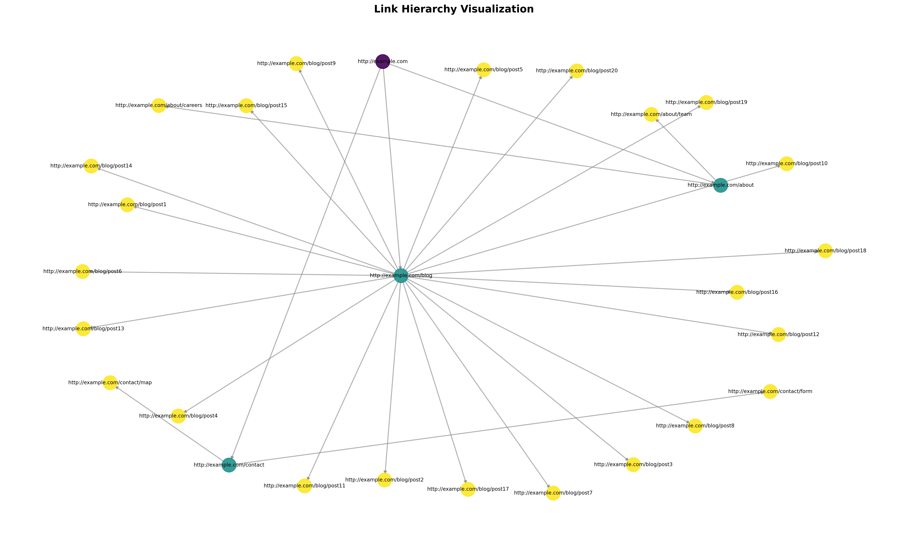

# 🕸️ FERRVMweb

This is a recursive web crawler written in **Rust** that visits websites, extracts links, and stores them in a **SQLite database**.

<div align ="center">

</div>

## Features

- Extracts all HTML links on the site
- Stores the discovered URL wtih a unique ID and parent ID
- Persists data in a SQLite database (table: `link`)
- Recursively crawls websites up to a configurable depth  

## 📊 Visualization

Each link is saved with its **parent URL** and **depth level**, allowing you to visualize the structured hierarchy of your crawled website:

## Static visualization with NetworkX library:

<div align="center">
  
</div>

## Interactive visualization with PyVis:

<div align="center">
  
</div>

## Usage

After crawling a website, visualize the link hierarchy using visualize_hierachy.py:

```bash
#To test run
python -u ".../link_db_test.py.py" #Fills the database
python -u ".../visualize_hierarchy.py" --db ./data/links_test.db 

#Generate all visualization layouts
python -u ".../visualize_hierarchy.py"

#Generate static layout
python -u ".../visualize_hierarchy.py" -s
python -u ".../visualize_hierarchy.py" --static

#Genaerate interactive layout
python -u ".../visualize_hierarchy.py" -i
python -u ".../visualize_hierarchy.py" --interactive
```

**Available layouts:**
- **Tree layout**: Hierarchical tree structure
- **dynamic layout**: interactive layout   

**Output file (static grpah):**
- `link_hierarchy_tree.png` - Hierarchical tree visualization

For more information about NetworkX: https://networkx.org/

## 📦 Crates

- [`reqwest`](https://docs.rs/reqwest/) – HTTP client  
- [`scraper`](https://docs.rs/scraper/) – HTML parser  
- [`rusqlite`](https://docs.rs/rusqlite/) – SQLite database integration 

## 💿 Installation

Install Python dependencies:

```bash
pip install networkx
pip install matplotlib
pip install pyvis
```

```bash
git clone https://github.com/jakobx0/FerrumWeb
cd FerrumWeb
cargo run (if rust is not installed: https://www.rust-lang.org/tools/install )
```

Rust help: https://users.rust-lang.org/t/link-exe-not-found-despite-build-tools-already-installed/47080

## ‼️Troubleshooting:

On Windows the Error: `linker 'link.exe' not found` can be solved via:

```bash
rustup toolchain install stable-x86_64-pc-windows-gnu
rustup default stable-x86_64-pc-windows-gnu
```
For Linux the Error: `failed to run custom build command for 'openssl-sys v0.9.109'`:

```bash
sudo apt install libssl-dev
```

## DB Usage

When the program starts, it asks for a URL and begins crawling from that page. All discovered links are stored recursively in a database. The resulting structure is useful for analyzing site architectures or detecting broken links.

To analyse the DB file simply open a DBMS of your choice.
For Example the **DB Browser for SQLite:**  https://sqlitebrowser.org/

Example SQL Queries:

  Count of distinct URLs:
  ```sql
  SELECT COUNT(DISTINCT URL) FROM link;
  ```
  Grouped links by frequency:
  ```sql
    SELECT URL, COUNT(*) AS count FROM link GROUP BY URL ORDER BY count DESC;
  ```
