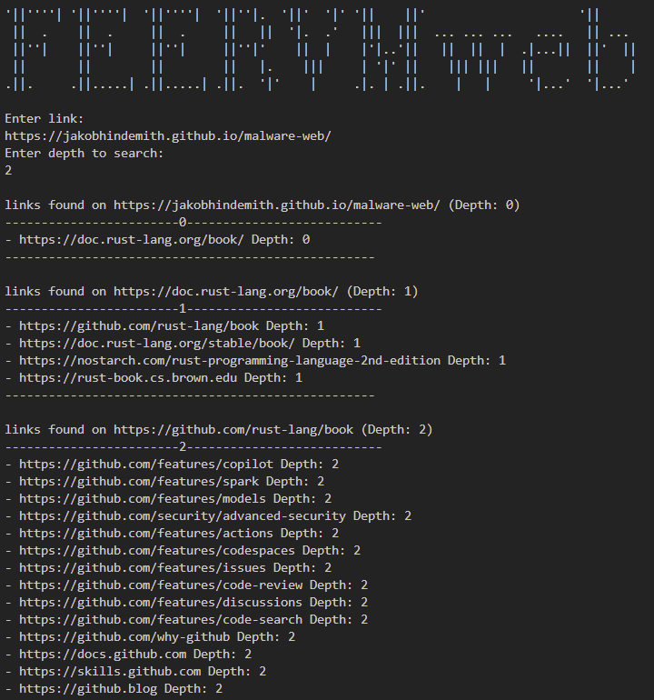
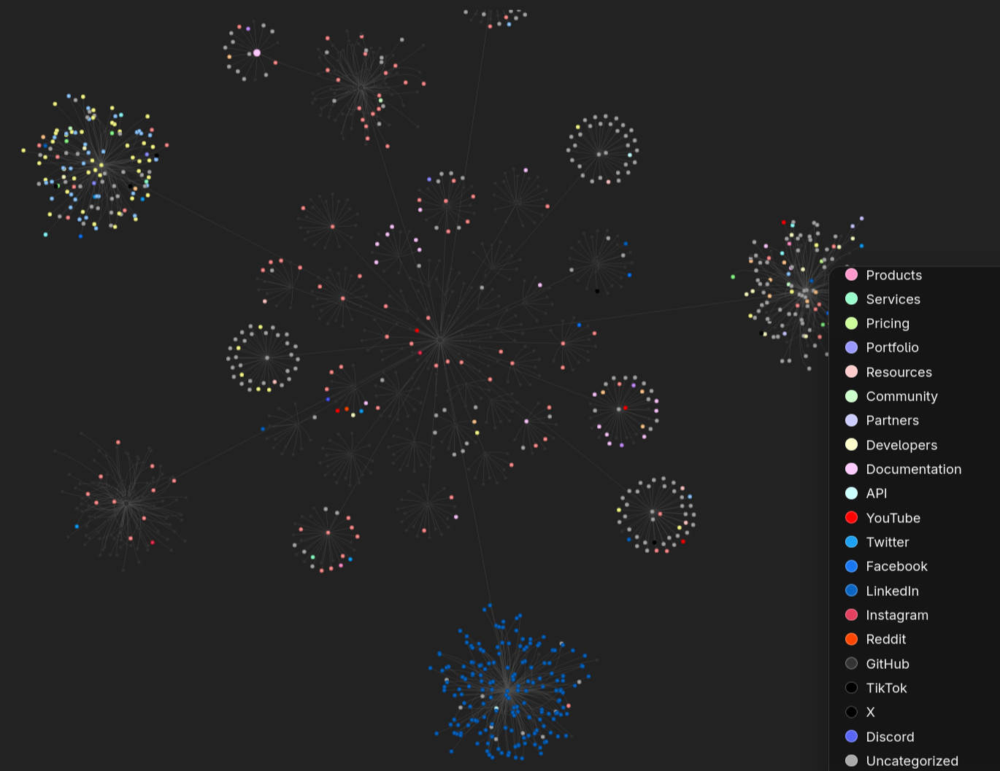
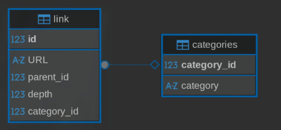

# FerrumWeb

FerrumWeb is a recursive web crawler written in Rust.
It starts from a root URL, discovers links, stores crawl results in SQLite, and provides Python based visualization of the crawl graph.

<div align="center">
  
</div>

## Highlights

- Recursive crawling with configurable maximum depth
- Stores crawl data in SQLite using `link` and `categories` tables
- Tracks parent child URL relationships and depth
- Generates an interactive hierarchy graph with PyVis
- Simple command line workflow for local experiments

## Visualization Preview

Each link is saved with its parent URL and depth level, allowing you to visualize the structured hierarchy of your crawled website.

<div align="center">
  
</div>

## Project Structure

```text
FerrumWeb/
├── src/
│   ├── main.rs                  # CLI input flow and crawl entry point
│   ├── crawler.rs               # Recursive crawler logic
│   └── db.rs                    # SQLite schema and insert helpers
├── visualize/
│   ├── visualize_hierarchy.py
│   ├── categories_db_fill.py
│   └── link_db_test.py
├── data/
│   ├── links.db
│   └── links_test.db
├── png/
│   ├── hierarchy.png
|   ├──  cmd.png
│   └── db_tabels.png
└── Cargo.toml
```

## Requirements

### Rust crawler

- Rust toolchain, stable recommended
- Build essentials for your platform

Install Rust:

- https://www.rust-lang.org/tools/install

### Python visualization

- Python 3.9 or newer
- `networkx`
- `pyvis`

## Quick Start

### 1) Clone and enter the project

```bash
git clone https://github.com/jakobx0/FerrumWeb.git
cd FerrumWeb
```

### 2) Run the crawler

```bash
cargo run
```

The CLI asks for:

1. Start URL, for example `https://example.com`
2. Maximum depth, for example `2`

Crawl results are written to:

- `data/links.db`

## Python Environment for Visualization

The virtual environment is stored in `visualize`.

### Linux and macOS

```bash
python3 -m venv ./visualize/.venv
source ./visualize/.venv/bin/activate
python -m pip install --upgrade pip
python -m pip install networkx pyvis
```

### Windows PowerShell

```powershell
python -m venv .\visualize\.venv
.\visualize\.venv\Scripts\Activate.ps1
python -m pip install --upgrade pip
python -m pip install networkx pyvis
```

## Visualization Workflow

### Option A: Use test data

```bash
python -u "visualize/link_db_test.py"
python -u "visualize/categories_db_fill.py"
python -u "visualize/visualize_hierarchy.py" --db ./data/links_test.db
```

### Option B: Use crawler output

```bash
python -u "visualize/categories_db_fill.py"
python -u "visualize/visualize_hierarchy.py" --db ./data/links.db
```

Output:

- `link_hierarchy.html` interactive graph

Open `link_hierarchy.html` in your browser.

## Database Schema

FerrumWeb creates these tables:

### `categories`

- `category_id INTEGER PRIMARY KEY`
- `category TEXT UNIQUE`

### `link`

- `id INTEGER PRIMARY KEY`
- `url TEXT NOT NULL`
- `parent_id INTEGER`
- `depth INTEGER`
- `category_id INTEGER` foreign key to `categories.category_id`

## Database Example View

<div align="center">
  
</div>

## Troubleshooting

### `cargo: command not found`

Install Rust and restart your shell:

```bash
rustup --version
cargo --version
```

### Linux OpenSSL build issues with `openssl-sys`

```bash
sudo apt update
sudo apt install -y libssl-dev pkg-config
```

### Windows linker error `link.exe not found`

Try the GNU toolchain fallback:

```bash
rustup toolchain install stable-x86_64-pc-windows-gnu
rustup default stable-x86_64-pc-windows-gnu
```

## Contributing

Contributions are welcome.

Suggested workflow:

1. Fork the repository
2. Create a feature branch
3. Make focused commits
4. Open a pull request with a clear description and test steps
